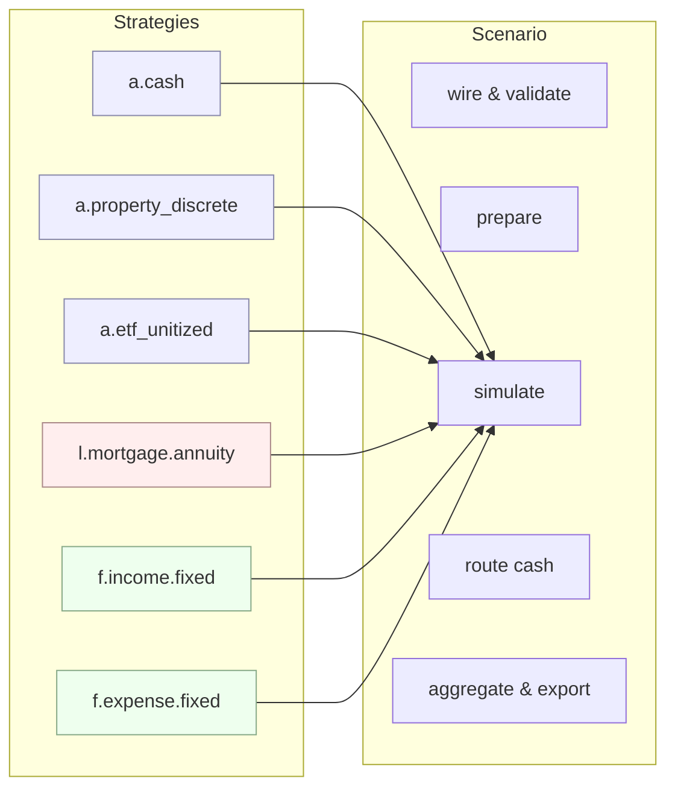

# FinBrickLab

*A modular, testable engine to model personal‑finance scenarios as composable **bricks**.*

[](#license)

> Define **assets**, **liabilities**, and **flows** as independent bricks, wire them into a **Scenario**, and simulate month‑by‑month with deterministic math. Use the lean **CLI** to run JSON specs or the **Python API** for full control.

---

## Table of Contents

* [Why FinBrickLab](#why-finbricklab)
* [Core Ideas](#core-ideas)
* [Architecture](#architecture)
* [Install](#install)
* [Quickstart (Python API)](#quickstart-python-api)
* [Quickstart (CLI)](#quickstart-cli)
* [Scenario JSON (minimal spec)](#scenario-json-minimal-spec)
* [Strategy Catalog](#strategy-catalog)
* [Outputs](#outputs)
* [Validation & Errors](#validation--errors)
* [Compatibility & Deprecations](#compatibility--deprecations)
* [Extending](#extending)
* [Development](#development)
* [Repository Layout](#repository-layout)
* [Roadmap](#roadmap)
* [Contributing](#contributing)
* [License](#license)

---

## Why FinBrickLab

Most "buy vs. rent" and personal‑finance tools are rigid spreadsheets. FinBrickLab is a small, composable engine you can test and version like real software:

* **Composability** — each instrument is an independent brick.
* **Determinism** — month‑granular timeline, repeatable runs.
* **Testability** — unit tests for math invariants + E2E scenarios.
* **Portability** — minimal runtime deps; CLI and Python API.

If you're an engineer/analyst who hates arbitrary rules of thumb, this is for you.

---

## Core Ideas

* **Brick**: typed component with `id`, `name`, `kind`, `spec`, optional `links`, and optional activation **window**.
* **Strategy**: the computation behind a brick. Families:

  * Asset → `IValuationStrategy`
  * Liability → `IScheduleStrategy`
  * Flow → `IFlowStrategy`
* **Kind**: stable string key that binds a brick to a strategy implementation (e.g., `a.cash`, `l.mortgage.annuity`).
* **Scenario**: orchestrates bricks, routes cash, aggregates totals, exports results.
* **Context**: timeline + shared configuration available in `prepare()` and `simulate()`.

---

## Architecture



---

## Install

```bash
# from source (dev)
poetry install
# or plain pip (editable)
pip install -e .
```

---

## Quickstart (Python API)

```python
from datetime import date
from finbricklab import Scenario, ABrick, LBrick

# 1) Bricks
cash = ABrick(
    id="cash",
    name="Main Cash",
    kind="a.cash",
    spec={"initial_balance": 50_000.0, "interest_pa": 0.02},
)

house = ABrick(
    id="house",
    name="Primary Residence",
    kind="a.property_discrete",
    spec={
        # Preferred field (property strategy also accepts legacy `price` with a deprecation warning)
        "initial_value": 400_000.0,
        "appreciation_pa": 0.03,
        # Acquisition fees as a fraction (e.g., taxes/notary). Applied at t0.
        "fees_pct": 0.10,
    },
)

mortgage = LBrick(
    id="mortgage",
    name="Fixed Mortgage",
    kind="l.mortgage.annuity",
    spec={
        "principal": 320_000.0,
        "rate_pa": 0.035,
        "term_months": 360,
        # If provided here and no window is set, Scenario normalizes this into window.start_date
        "start_date": "2026-01-01",
    },
)

# 2) Scenario
scenario = Scenario(id="demo", name="House Purchase Demo", bricks=[cash, house, mortgage])

# 3) Run 12 months starting Jan 2026
results = scenario.run(start=date(2026, 1, 1), months=12)

# 4) Inspect totals as a DataFrame (typical columns: cash, assets, liabilities)
totals = results["totals"]
print("Final cash:", totals.iloc[-1]["cash"])  # .iloc for explicit row indexing
print("Final assets:", totals.iloc[-1]["assets"])
print("Final liabilities:", totals.iloc[-1]["liabilities"])
```

---

## Quickstart (CLI)

```bash
# Print a minimal scenario JSON
finbrick example > demo.json

# Run 12 months from 2026-01-01
finbrick run -i demo.json -o results.json --start 2026-01-01 --months 12

# Validate configuration (errors by default; use --warn for non-fatal warnings)
finbrick validate -i demo.json
```

---

## Scenario JSON (minimal spec)

```json
{
  "id": "demo",
  "name": "CLI Demo",
  "bricks": [
    {
      "id": "cash",
      "name": "Main Cash",
      "kind": "a.cash",
      "spec": { "initial_balance": 50000.0, "interest_pa": 0.02 },
      "window": { "start_date": "2026-01-01" }
    },
    {
      "id": "house",
      "name": "Primary Residence",
      "kind": "a.property_discrete",
      "spec": { "initial_value": 400000.0, "appreciation_pa": 0.03, "fees_pct": 0.10 }
    },
    {
      "id": "mortgage",
      "name": "Fixed Mortgage",
      "kind": "l.mortgage.annuity",
      "spec": { "principal": 320000.0, "rate_pa": 0.035, "term_months": 360, "start_date": "2026-01-01" }
    }
  ]
}
```

**Notes**

* `start_date` inside a mortgage `spec` is normalized into the brick `window` if no window is set.
* The property strategy accepts `initial_value` (preferred) **or** legacy `price` (deprecated; warns).

---

## Strategy Catalog

| Family    | Kind                  | What it models                   | Key `spec` fields (examples)                                                      |
| --------- | --------------------- | -------------------------------- | --------------------------------------------------------------------------------- |
| Asset     | `a.cash`              | Interest‑bearing cash account    | `initial_balance`, `interest_pa`                                                  |
| Asset     | `a.property_discrete` | Property with discrete valuation | `initial_value` (or legacy `price`), `appreciation_pa`, `fees_pct`                |
| Asset     | `a.etf_unitized`      | Unitized ETF position            | `initial_units` \| `initial_value`+`price_0`, `price_series?`, `contrib_schedule?` |
| Liability | `l.mortgage.annuity`  | Fixed‑rate annuity mortgage      | `principal`, `rate_pa`, `term_months`, `start_date?` (normalized to window)       |
| Flow      | `f.income.fixed`      | Fixed recurring income           | `amount_m`, `start_date?`, `end_date?`                                            |
| Flow      | `f.expense.fixed`     | Fixed recurring expense          | `amount_m`, `start_date?`, `end_date?`                                            |

> For full specs, see `src/finbricklab/strategies/` and the tests under `tests/`.

---

## Outputs

Each strategy returns a conceptual **`BrickOutput`**:

* `cash_in[T]`, `cash_out[T]` — arrays aligned to the scenario timeline
* `asset_value[T]`, `debt_balance[T]` — arrays aligned to the timeline
* `events[]` — optional discrete events (fees, prepayments, etc.)

A **Scenario run** returns a structure that includes:

* `bricks` — per‑brick outputs
* `totals` — a **DataFrame** with time index; typical columns include `cash`, `assets`, `liabilities` (and may include others depending on your build)
* JSON export — via `export_run_json()` (shape stable within a minor series)

---

## Validation & Errors

* **Structural** (during wiring/prepare): e.g., missing links, invalid kinds, bad windows.
* **Runtime** (during simulate/route): e.g., negative balances where disallowed.
* Modes: `error` (default) or `warn` (non‑fatal).

Typical checks:

* Mortgage principal links target an existing property.
* Activation windows are non‑negative and consistent.
* Settlement buckets (if configured) route into real cash accounts.

---

## Compatibility & Deprecations

* **Property `price` → `initial_value`**: `price` is supported with a **DeprecationWarning**; prefer `initial_value`.
* **Mortgage `start_date` in `spec`**: accepted, then normalized into the brick `window` if not set.
* **Package alias**: the `finscenlab` shim re‑exports `finbricklab` symbols and emits a deprecation warning. Migrate imports.

---

## Extending

1. Implement one of the interfaces in `src/finbricklab/core/interfaces.py`:

```python
from finbricklab.core.interfaces import IValuationStrategy
from finbricklab.core.results import BrickOutput

class MyAsset(IValuationStrategy):
    def prepare(self, brick, ctx):
        # validate parameters, precompute constants
        ...
    def simulate(self, brick, ctx) -> BrickOutput:
        # return arrays sized to ctx timeline
        ...
```

2. Register under a new **kind** in the strategies registry.
3. Add unit tests for math invariants + a tiny E2E scenario.

---

## Development

```bash
# Install (dev)
poetry install

# Run tests
poetry run pytest -q

# Lint & type-check
poetry run ruff check .
poetry run black --check .
poetry run mypy .

# Pre-commit hooks
pre-commit install
pre-commit run --all-files
```

**Releases**

* Tag with semantic versioning (e.g., `v0.1.0`).
* CI should execute README snippets to avoid drift.

---

## Repository Layout

```
finbricklab/
├── src/finbricklab/
│   ├── core/                # bricks, scenario, context, interfaces, results
│   ├── strategies/          # asset/liability/flow strategies + registry
│   └── cli.py               # finbrick CLI entry point
├── tests/                   # unit & integration tests
├── examples/                # examples & legacy POC (not packaged)
├── pyproject.toml
├── README.md (this file)
├── LICENSE (Apache-2.0)
└── NOTICE
```

---

## Roadmap

* Broader strategy set (bonds, variable‑rate mortgages, DCA/SDCA flows)
* Richer validation & JSON schema docs
* Deterministic export snapshots + baseline comparisons
* Documentation site (MkDocs) with tutorials

---

## Contributing

* Pull requests welcome. Please include tests for new math or behaviors.
* Use conventional commits if possible; keep PRs focused.
* By contributing, you agree to the Developer Certificate of Origin (DCO). A simple `Signed-off-by` line in your commits is sufficient.

---

## License

Licensed under the **Apache License, Version 2.0**. See [LICENSE](./LICENSE).
© 2025 FinBrickLab Team.