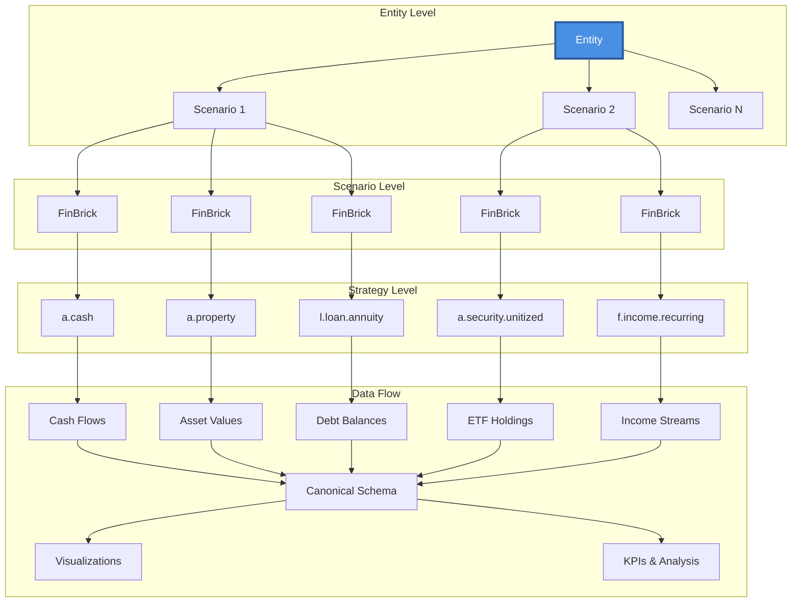
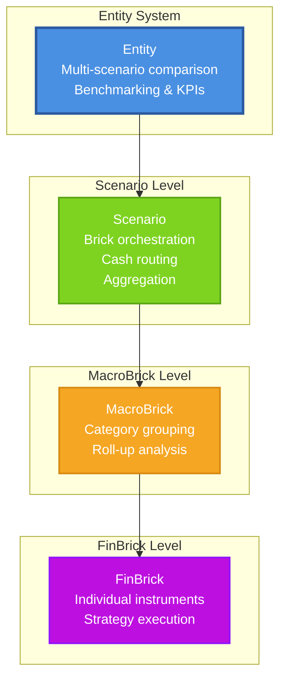
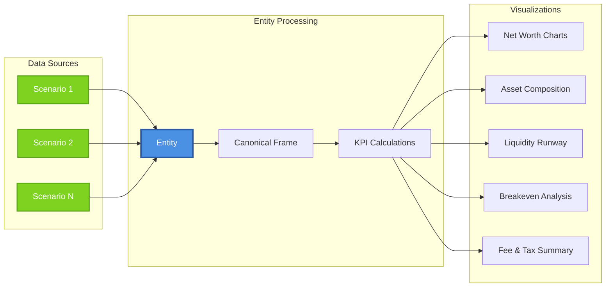

# FinBrickLab

*A modular, testable engine to model personal‑finance scenarios as composable **bricks** with multi-scenario **Entity** comparisons.*

[](#license)

> Define **assets**, **liabilities**, and **flows** as independent bricks, wire them into **Scenarios**, group scenarios into **Entities** for comparison, and simulate month‑by‑month with deterministic math. Use the lean **CLI** to run JSON specs, the **Python API** for full control, or **Entity comparisons** for multi-scenario analysis with rich visualizations.

---

## Table of Contents

* [Why FinBrickLab](#why-finbricklab)
* [Core Ideas](#core-ideas)
* [Architecture](#architecture)
* [Entity System](#entity-system)
* [Install](#install)
* [Quickstart (Python API)](#quickstart-python-api)
* [Quickstart (Entity Comparisons)](#quickstart-entity-comparisons)
* [Quickstart (CLI)](#quickstart-cli)
* [Scenario JSON (minimal spec)](#scenario-json-minimal-spec)
* [Strategy Catalog](#strategy-catalog)
* [Outputs](#outputs)
* [Visualization](#visualization)
* [Validation & Errors](#validation--errors)
* [Extending](#extending)
* [Development](#development)
* [Repository Layout](#repository-layout)
* [Roadmap](#roadmap)
* [Contributing](#contributing)
* [License](#license)

---

## Why FinBrickLab

Most "buy vs. rent" and personal‑finance tools are rigid spreadsheets. FinBrickLab is a small, composable engine you can test and version like real software:

* **Composability** — each instrument is an independent brick.
* **Multi-scenario comparison** — group scenarios into Entities for benchmarking.
* **Determinism** — month‑granular timeline, repeatable runs.
* **Testability** — unit tests for math invariants + E2E scenarios.
* **Rich visualizations** — interactive charts for scenario analysis.
* **Portability** — minimal runtime deps; CLI and Python API.

If you're an engineer/analyst who hates arbitrary rules of thumb, this is for you.

---

## Core Ideas

* **Brick**: typed component with `id`, `name`, `kind`, `spec`, optional `links`, and optional activation **window**.
* **Strategy**: the computation behind a brick. Families:

  * Asset → `IValuationStrategy`
  * Liability → `IScheduleStrategy`
  * Flow → `IFlowStrategy`
  * Transfer → `ITransferStrategy` (new)
* **Kind**: stable string key that binds a brick to a strategy implementation (e.g., `K.A_CASH`, `K.L_LOAN_ANNUITY`, `K.T_TRANSFER_LUMP_SUM`).
* **Journal**: double-entry bookkeeping system that records all financial transactions with proper accounting invariants.
* **Scenario**: orchestrates bricks, compiles to Journal entries, aggregates totals, exports results.
* **Entity**: groups multiple scenarios for comparison, benchmarking, and visualization.
* **Context**: timeline + shared configuration available in `prepare()` and `simulate()`.
* **MacroBrick**: composite structure grouping heterogeneous bricks into named views for analysis and presentation.

## How Totals Work

**Per-MacroBrick view**: sums all executed member bricks of that MacroBrick.
**Portfolio totals**: sum unique bricks from selection (union).
**Summing multiple MacroBrick rows can overstate due to overlap → use portfolio total.**

Example: If `house` appears in both `primary_residence` and `property_portfolio` MacroBricks, the portfolio total includes `house` once, but summing both MacroBrick totals would count `house` twice.

---

## Architecture



### System Hierarchy



---

## Journal System

FinBrickLab now uses a **double-entry bookkeeping system** to ensure financial accuracy and consistency:

### Key Features

- **Double-Entry**: Every transaction has balanced debits and credits
- **Account Scopes**: Internal accounts (cash, assets) vs Boundary accounts (income, expenses)
- **Currency Precision**: Decimal arithmetic with currency-specific quantization
- **Invariant Validation**: Automatic checking of accounting rules
- **Deterministic**: Repeatable runs with stable transaction IDs

### Account Types

| Scope     | Type      | Examples                    | Purpose                    |
|-----------|-----------|-----------------------------|----------------------------|
| Internal  | Asset     | Cash accounts, investments  | Money within the system   |
| Internal  | Liability | Mortgages, loans            | Debts within the system   |
| Boundary  | Income    | Salary, dividends           | Money entering system     |
| Boundary  | Expense   | Rent, groceries             | Money leaving system      |
| Boundary  | P&L       | Unrealized gains, FX        | Profit/loss tracking      |
| Boundary  | Equity    | Opening balance             | Net worth reconciliation  |

### Transfer Bricks

New **TBrick** family for internal transfers between accounts:

```python
# One-time transfer
transfer = TBrick(
    id="emergency_transfer",
    name="Emergency Transfer",
    kind="t.transfer.lumpsum",
    spec={"amount": 5000.0, "currency": "EUR"},
    links={"from": "checking", "to": "savings"}
)

# Recurring transfer
monthly_save = TBrick(
    id="monthly_save",
    name="Monthly Savings",
    kind="t.transfer.recurring",
    spec={"amount": 1000.0, "currency": "EUR", "freq": "MONTHLY", "day": 1},
    links={"from": "checking", "to": "savings"}
)
```

### Journal Validation

The system automatically validates:
- **Zero-sum entries**: All transactions balance to zero
- **Account scopes**: Transfers only between internal accounts
- **Net worth consistency**: Total assets = liabilities + equity
- **Currency precision**: Proper decimal handling per currency

---

## Entity System

The Entity system enables multi-scenario comparison and benchmarking with a canonical schema for consistent analysis.

### Key Features

- **Multi-scenario comparison**: Compare multiple scenarios side-by-side
- **Benchmarking**: Define baseline scenarios for breakeven analysis
- **Consistent schema**: All scenarios emit data in the same canonical format
- **Rich visualizations**: Interactive charts for scenario analysis
- **KPI calculations**: Built-in metrics like liquidity runway, breakeven analysis, and fee/tax summaries

### Canonical Schema

All scenarios emit standardized monthly data:

| Column | Type | Description |
|--------|------|-------------|
| `date` | datetime64 | Month-end dates |
| `cash` | float64 | Immediately spendable cash |
| `liquid_assets` | float64 | Tradable assets (≤5 business days) |
| `illiquid_assets` | float64 | Non-tradable assets (property, private equity) - mapped from property_value when available |
| `liabilities` | float64 | All debt balances |
| `inflows` | float64 | Post-tax income + dividends + rents |
| `outflows` | float64 | Consumption + rent + maintenance + insurance |
| `taxes` | float64 | Tax payments (currently defaults to 0) |
| `fees` | float64 | Fee payments (currently defaults to 0) |
| `total_assets` | float64 | `cash + liquid_assets + illiquid_assets` |
| `net_worth` | float64 | `total_assets - liabilities` |

### Visualization Workflow



### Multi-Currency Support

The Entity system includes FX (Foreign Exchange) utilities for scenarios with different base currencies:

```python
from finbricklab import FXConverter, create_fx_converter

# Create FX converter with exchange rates
fx_converter = create_fx_converter("EUR", {
    ("USD", "EUR"): 0.85,  # 1 USD = 0.85 EUR
    ("GBP", "EUR"): 1.18,  # 1 GBP = 1.18 EUR
})

# Convert DataFrame from USD to EUR
usd_data = pd.DataFrame({"cash": [1000, 2000], "date": [...]})
eur_data = fx_converter.convert_frame(usd_data, "USD", "EUR")
```

**Note**: Currently, all scenarios within an Entity must use the same base currency. Multi-currency scenarios require manual FX conversion before Entity comparison.

---

## Install

```bash
# from source (dev)
poetry install

# with visualization support (Plotly charts)
poetry install --extras viz

# or plain pip (editable)
pip install -e .

# with visualization support
pip install -e .[viz]
```

---

## Quickstart (Python API)

```python
from datetime import date
from finbricklab import Scenario, ABrick, LBrick

# 1) Bricks
from finbricklab.core.kinds import K

cash = ABrick(
    id="cash",
    name="Main Cash",
    kind=K.A_CASH,
    spec={"initial_balance": 50_000.0, "interest_pa": 0.02},
)

house = ABrick(
    id="house",
    name="Primary Residence",
    kind=K.A_PROPERTY,
    spec={
        "initial_value": 400_000.0,
        "appreciation_pa": 0.03,
        # Acquisition fees as a fraction (e.g., taxes/notary). Applied at t0.
        "fees_pct": 0.10,
    },
)

mortgage = LBrick(
    id="mortgage",
    name="Fixed Mortgage",
    kind=K.L_LOAN_ANNUITY,
    spec={
        "principal": 320_000.0,
        "rate_pa": 0.035,
        "term_months": 360,
        # If provided here and no window is set, Scenario normalizes this into window.start_date
        "start_date": "2026-01-01",
    },
)

# 2) Scenario
scenario = Scenario(id="demo", name="House Purchase Demo", bricks=[cash, house, mortgage])

# 3) Run 12 months starting Jan 2026
results = scenario.run(start=date(2026, 1, 1), months=12)

# 4) Inspect totals as a DataFrame (typical columns: cash, assets, liabilities)
totals = results["totals"]
print("Final cash:", totals.iloc[-1]["cash"])  # .iloc for explicit row indexing
print("Final assets:", totals.iloc[-1]["assets"])
print("Final liabilities:", totals.iloc[-1]["liabilities"])
```

### Multi-cash routing

The Journal system automatically routes flows to all cash accounts by default, ensuring proper double-entry bookkeeping:

```python
from finbricklab.core.kinds import K

checking = ABrick(id="checking", name="Checking", kind=K.A_CASH, spec={"initial_balance": 500.0})
savings  = ABrick(id="savings",  name="Savings",  kind=K.A_CASH, spec={"initial_balance": 5000.0})

salary = FBrick(
    id="salary",
    name="Salary",
    kind=K.F_INCOME_RECURRING,
    spec={"amount_monthly": 3000.0}
    # No routing needed - Journal system handles automatically
)

rent = FBrick(
    id="rent",
    name="Rent",
    kind=K.F_EXPENSE_RECURRING,
    spec={"amount_monthly": 1200.0}
    # No routing needed - Journal system handles automatically
)

scenario = Scenario(
    id="multi-cash",
    name="Multi-cash routing",
    bricks=[checking, savings, salary, rent]
)

results = scenario.run(start=date(2026, 1, 1), months=12)
```

### Internal Transfers

Use **TBrick** for explicit transfers between accounts:

```python
# Transfer money between accounts
transfer = TBrick(
    id="monthly_save",
    name="Monthly Savings",
    kind="t.transfer.recurring",
    spec={"amount": 1000.0, "currency": "EUR", "freq": "MONTHLY", "day": 1},
    links={"from": "checking", "to": "savings"}
)
```

The Journal system ensures all transfers are properly balanced and validated.

---

## Entity-Centric Builder

The Entity class now serves as both a catalog and builder, making it the central orchestrator for creating financial scenarios:

```python
from datetime import date
import finbricklab.strategies  # Ensure strategies are registered

from finbricklab import Entity
from finbricklab.core.kinds import K

# Create entity as the central builder
entity = Entity(id="person", name="John Doe")

# Build bricks through entity methods
entity.new_ABrick(
    id="checking",
    name="Checking Account",
    kind=K.A_CASH,
    spec={"initial_balance": 5000.0, "interest_pa": 0.02}
)

entity.new_ABrick(
    id="savings",
    name="Savings Account",
    kind=K.A_CASH,
    spec={"initial_balance": 10000.0, "interest_pa": 0.03}
)

entity.new_FBrick(
    id="salary",
    name="Monthly Salary",
    kind=K.F_INCOME_RECURRING,
    spec={"amount_monthly": 6000.0},
    links={"route": {"to": "checking"}}
)

# Create MacroBrick for portfolio organization
entity.new_MacroBrick(
    id="liquid_assets",
    name="Liquid Assets",
    member_ids=["checking", "savings"]
)

# Create scenarios by referencing brick IDs
scenario = entity.create_scenario(
    id="base_case",
    name="Base Case Scenario",
    brick_ids=["salary"],            # Direct brick references
    macrobrick_ids=["liquid_assets"], # MacroBrick expansion
    settlement_default_cash_id="checking"
)

# Run scenario
results = scenario.run(start=date(2026, 1, 1), months=12)

# Or run directly through entity
results = entity.run_scenario(
    "base_case",
    start=date(2026, 1, 1),
    months=12,
)
```

### Key Benefits

- **Single Entry Point**: Entity becomes the central builder and catalog
- **ID-Based References**: Clean separation between structure and implementation
- **Automatic Validation**: Built-in validation with detailed error messages
- **Deep Copy Isolation**: Scenarios are independent, preventing state bleed
- **MacroBrick Support**: Organize bricks hierarchically and reuse across scenarios

### Error Handling

The builder provides detailed error information through `ScenarioValidationError`:

```python
from finbricklab import ScenarioValidationError

try:
    entity.create_scenario(
        id="invalid",
        name="Invalid Scenario",
        brick_ids=["nonexistent_brick"]
    )
except ScenarioValidationError as e:
    print(f"Scenario {e.scenario_id} failed: {e}")
    print(f"Problem IDs: {e.problem_ids}")
```

---

## Quickstart (Entity Comparisons)

```python
from datetime import date
from finbricklab.core.entity import Entity
from finbricklab.core.scenario import Scenario
from finbricklab.core.bricks import ABrick, LBrick
from finbricklab.core.kinds import K
from finbricklab.charts import net_worth_vs_time, asset_composition_small_multiples

# Create different scenarios
def create_conservative_scenario():
    cash = ABrick(id="cash", name="Cash", kind=K.A_CASH,
                  spec={"initial_balance": 50000.0})
    etf = ABrick(id="etf", name="ETF", kind=K.A_SECURITY_UNITIZED,
                 spec={"price0": 100.0, "drift_pa": 0.05, "initial_value": 30000.0})
    return Scenario(id="conservative", name="Conservative", bricks=[cash, etf])

def create_aggressive_scenario():
    cash = ABrick(id="cash", name="Cash", kind=K.A_CASH,
                  spec={"initial_balance": 20000.0})
    house = ABrick(id="house", name="House", kind=K.A_PROPERTY,
                   spec={"initial_value": 400000.0, "appreciation_pa": 0.03, "fees_pct": 0.05})
    mortgage = LBrick(id="mortgage", name="Mortgage", kind=K.L_LOAN_ANNUITY,
                      spec={"principal": 320000.0, "rate_pa": 0.035, "term_months": 360})
    return Scenario(id="aggressive", name="Aggressive", bricks=[cash, house, mortgage])

# Create and run scenarios
scenario1 = create_conservative_scenario()
scenario2 = create_aggressive_scenario()

scenario1.run(start=date(2026, 1, 1), months=36)
scenario2.run(start=date(2026, 1, 1), months=36)

# Create entity for comparison
entity = Entity(
    id="my_entity",
    name="My Financial Entity",
    scenarios=[scenario1, scenario2],
    benchmarks={"baseline": "conservative"}
)

# Compare scenarios
comparison_df = entity.compare(["conservative", "aggressive"])
print(f"Comparison data shape: {comparison_df.shape}")

# Create visualizations
fig1, _ = net_worth_vs_time(comparison_df)
fig1.show()

fig2, _ = asset_composition_small_multiples(comparison_df)
fig2.show()

# Analyze breakeven
breakeven_df = entity.breakeven_table("conservative")
print("Breakeven analysis:")
print(breakeven_df)

# Check liquidity runway
runway_df = entity.liquidity_runway()
print("Liquidity runway (first 6 months):")
print(runway_df.head())
```

---

## Quickstart (CLI)

```bash
# Print a minimal scenario JSON
finbrick example > demo.json

# Run 12 months from 2026-01-01
finbrick run -i demo.json -o results.json --start 2026-01-01 --months 12

# Validate configuration (errors by default; use --warn for non-fatal warnings)
finbrick validate -i demo.json
```

---

## Scenario JSON (minimal spec)

```json
{
  "id": "demo",
  "name": "CLI Demo",
  "bricks": [
    {
      "id": "cash",
      "name": "Main Cash",
      "kind": "a.cash",
      "spec": { "initial_balance": 50000.0, "interest_pa": 0.02 },
      "window": { "start_date": "2026-01-01" }
    },
    {
      "id": "house",
      "name": "Primary Residence",
      "kind": "a.property",
      "spec": { "initial_value": 400000.0, "appreciation_pa": 0.03, "fees_pct": 0.10 }
    },
    {
      "id": "mortgage",
      "name": "Fixed Mortgage",
      "kind": "l.loan.annuity",
      "spec": { "principal": 320000.0, "rate_pa": 0.035, "term_months": 360, "start_date": "2026-01-01" }
    }
  ]
}
```

**Notes**

* `start_date` inside a mortgage `spec` is normalized into the brick `window` if no window is set.

---

## Strategy Catalog

| Family    | Kind                  | What it models                   | Key `spec` fields (examples)                                                      |
| --------- | --------------------- | -------------------------------- | --------------------------------------------------------------------------------- |
| Asset     | `K.A_CASH`              | Interest‑bearing cash account    | `initial_balance`, `interest_pa`                                                  |
| Asset     | `K.A_PROPERTY` | Property with discrete valuation | `initial_value`, `appreciation_pa`, `fees_pct`                |
| Asset     | `K.A_SECURITY_UNITIZED`      | Unitized ETF position            | `initial_units` \| `initial_value`+`price0`, `price_series?`, `contrib_schedule?` |
| Asset     | `K.A_PRIVATE_EQUITY`      | Private equity investment        | `initial_value`, `drift_pa`, `valuation_frequency` |
| Liability | `K.L_LOAN_ANNUITY`  | Fixed‑rate annuity mortgage      | `principal`, `rate_pa`, `term_months`, `start_date?` (normalized to window)       |
| Liability | `K.L_LOAN_BALLOON`  | Balloon payment loan             | `principal`, `rate_pa`, `term_months`, `amortization`, `balloon_at_maturity` |
| Liability | `K.L_CREDIT_LINE`  | Revolving credit line            | `credit_limit`, `rate_pa`, `min_payment`, `billing_day` |
| Liability | `K.L_CREDIT_FIXED`  | Fixed-term credit                | `principal`, `rate_pa`, `term_months`, `start_date` |
| Flow      | `K.F_INCOME_RECURRING`      | Fixed recurring income           | `amount_monthly`, `start_date?`, `end_date?`                                            |
| Flow      | `K.F_INCOME_ONE_TIME`      | One-time income                  | `amount`, `date`, `tax_rate?` |
| Flow      | `K.F_EXPENSE_RECURRING`     | Fixed recurring expense          | `amount_monthly`, `start_date?`, `end_date?`                                            |
| Flow      | `K.F_EXPENSE_ONE_TIME`     | One-time expense                 | `amount`, `date`, `tax_deductible?`, `tax_rate?` |
| Transfer  | `K.T_TRANSFER_LUMP_SUM`  | One-time internal transfer       | `amount`, `currency`, `from`, `to`                                                |
| Transfer  | `K.T_TRANSFER_RECURRING`| Recurring internal transfer      | `amount`, `currency`, `freq`, `day`, `from`, `to`                                 |
| Transfer  | `K.T_TRANSFER_SCHEDULED`| Scheduled internal transfers     | `schedule` (list of transfer events)                                              |

> For full specs, see `src/finbricklab/strategies/` and the tests under `tests/`.

---

## Outputs

Each strategy returns a conceptual **`BrickOutput`**:

* `cash_in[T]`, `cash_out[T]` — arrays aligned to the scenario timeline
* `assets[T]`, `liabilities[T]` — arrays aligned to the timeline
* `events[]` — optional discrete events (fees, prepayments, etc.)

A **Scenario run** returns a structure that includes:

* `bricks` — per‑brick outputs
* `totals` — a **DataFrame** with time index; typical columns include `cash`, `assets`, `liabilities` (and may include others depending on your build)
* JSON export — via `export_run_json()` (shape stable within a minor series)

---

## Visualization

FinBrickLab provides rich interactive visualizations through the Entity system and chart functions.

### Installation

```bash
# Install with visualization support
poetry install --extras viz
# or
pip install -e .[viz]
```

### Available Charts

#### Entity-Level Charts
- **Net Worth Over Time**: Compare net worth across scenarios
- **Asset Composition**: Small multiples showing cash/liquid/illiquid assets
- **Liabilities Amortization**: Debt reduction over time
- **Liquidity Runway**: Heatmap showing months of buffer
- **Cumulative Fees & Taxes**: Cost comparison at different horizons
- **Net Worth Drawdown**: Risk analysis across scenarios

#### Scenario-Level Charts
- **Cashflow Waterfall**: Annual income → expenses breakdown
- **Owner Equity vs Property Value**: Real estate analysis
- **LTV & DSTI Over Time**: Risk metrics evolution
- **Contribution vs Market Growth**: Performance attribution

### Chart Usage

```python
from finbricklab.charts import net_worth_vs_time, asset_composition_small_multiples

# Get comparison data from entity
comparison_df = entity.compare(["scenario1", "scenario2"])

# Create charts
fig1, data1 = net_worth_vs_time(comparison_df)
fig2, data2 = asset_composition_small_multiples(comparison_df)

# Display or save
fig1.show()
fig2.write_html("asset_composition.html")
```

### Chart Features

- **Interactive**: Hover details, zoom, pan
- **Exportable**: HTML, PNG, PDF, SVG formats
- **Consistent styling**: Professional financial chart appearance
- **Small multiples**: Compare multiple scenarios effectively
- **Threshold indicators**: Visual cues for risk levels

---

## Validation & Errors

* **Structural** (during wiring/prepare): e.g., missing links, invalid kinds, bad windows.
* **Runtime** (during simulate/route): e.g., negative balances where disallowed.
* Modes: `error` (default) or `warn` (non‑fatal).

Typical checks:

* Mortgage principal links target an existing property.
* Activation windows are non‑negative and consistent.
* Settlement buckets (if configured) route into real cash accounts.

---


## Extending

1. Implement one of the interfaces in `src/finbricklab/core/interfaces.py`:

```python
from finbricklab.core.interfaces import IValuationStrategy
from finbricklab.core.results import BrickOutput

class MyAsset(IValuationStrategy):
    def prepare(self, brick, ctx):
        # validate parameters, precompute constants
        ...
    def simulate(self, brick, ctx) -> BrickOutput:
        # return arrays sized to ctx timeline
        ...
```

2. Register under a new **kind** in the strategies registry.
3. Add unit tests for math invariants + a tiny E2E scenario.

---

## Development

```bash
# Install (dev)
poetry install

# Run tests
poetry run pytest -q

# Lint & type-check
poetry run ruff check .
poetry run black --check .
poetry run mypy .

# Pre-commit hooks
pre-commit install
pre-commit run --all-files
```

**Releases**

* Tag with semantic versioning (e.g., `v0.1.0`).
* CI should execute README snippets to avoid drift.

---

## Repository Layout

```
finbricklab/
├── src/finbricklab/
│   ├── core/                # bricks, scenario, context, interfaces, results
│   │   ├── entity.py        # Entity class for multi-scenario comparison
│   │   ├── scenario.py      # Scenario orchestration + canonical schema
│   │   └── ...              # other core modules
│   ├── strategies/          # asset/liability/flow strategies + registry
│   ├── charts.py            # visualization functions (requires plotly)
│   ├── kpi.py               # KPI calculation utilities
│   ├── fx.py                # Foreign exchange utilities
│   └── cli.py               # finbrick CLI entry point
├── tests/                   # unit & integration tests
│   ├── test_entity_*.py     # Entity system tests
│   ├── test_kpi_utilities.py # KPI function tests
│   ├── test_fx_utilities.py  # FX utility tests
│   ├── data/golden_12m.csv   # Golden dataset for testing
│   └── ...                  # other test modules
├── docs/                    # comprehensive documentation
│   ├── API_REFERENCE.md      # Complete API documentation
│   ├── STRATEGIES.md         # Strategy catalog
│   ├── EXAMPLES.md           # Comprehensive examples (includes MacroBrick usage)
│   ├── CONTRIBUTING.md       # Development guide
│   └── ENTITY_AND_CANONICAL_SCHEMA.md  # Entity system docs
├── scripts/                 # utility scripts
│   └── check_forbidden_tokens.py  # CI token guard
├── examples/                # examples (not packaged)
├── pyproject.toml           # dependencies + optional [viz] extras
├── README.md (this file)
├── LICENSE (Apache-2.0)
└── NOTICE
```

---

## Roadmap

### Completed ✅
* **Entity System**: Multi-scenario comparison and benchmarking
* **Canonical Schema**: Standardized data format for all scenarios
* **Rich Visualizations**: Interactive Plotly charts for analysis
* **KPI Calculations**: Liquidity runway, breakeven analysis, fee/tax summaries

### Shipped ✅
* MacroBrick enhancements: `category_allocation_over_time`, `category_cashflow_bars`
* FinBrick timeline: `event_timeline`
* Holdings & basis: `holdings_cost_basis`
* KPI utilities: `dsti`, `ltv`, `fee_drag_cum`, `effective_tax_rate`, `liquidity_runway`, `max_drawdown`, `tax_burden_cum`, `interest_paid_cum`

### Planned 📋
* Broader strategy set (bonds, var-rate mortgages, DCA/SDCA flows)
* Scenario diffs view (structural & numeric deltas)
* Mortgage schedule lens for FinBricks (amort schedule inspection)
* Richer validation & JSON schema docs
* Deterministic export snapshots + baseline comparisons
* Documentation site (MkDocs) with tutorials
* Monte Carlo simulations with Entity benchmarking
* Real-time data integration for market prices

---

## Contributing

* Pull requests welcome. Please include tests for new math or behaviors.
* Use conventional commits if possible; keep PRs focused.
* By contributing, you agree to the Developer Certificate of Origin (DCO). A simple `Signed-off-by` line in your commits is sufficient.

---

## License

Licensed under the **Apache License, Version 2.0**. See [LICENSE](./LICENSE).
© 2025 FinBrickLab Team.
