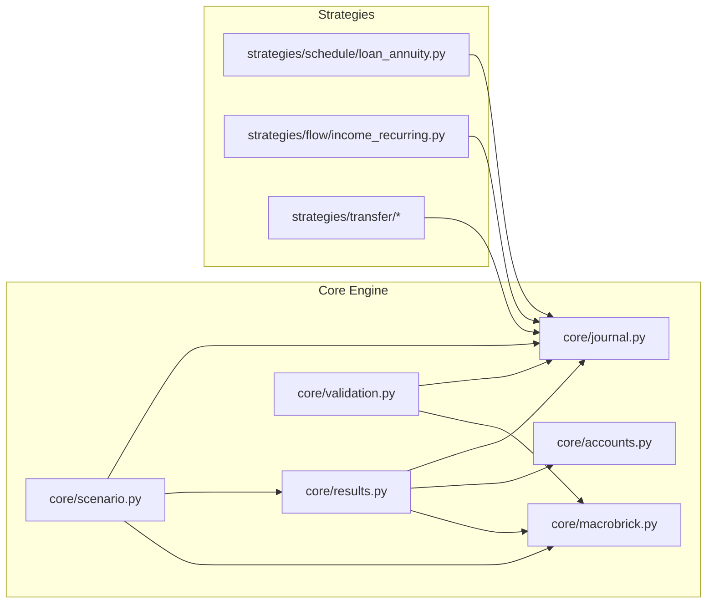

# Technical Specification: Postings Model & Brick Types (Implementation)

This document translates the logic spec into concrete, code‑level changes for this repository. It defines data contracts, touchpoints, algorithms, and a single‑cutover plan to implement the Postings Model (v2) with FlowShellBrick/TransferShellBrick and MacroGroup inspection.

## Scope
- Replace per‑brick inflow/outflow arrays for A/L with journal‑first aggregation (A/L remain balance‑only, plus optional signed interest).
- Introduce Shell bricks (FlowShellBrick/TransferShellBrick) as generators of entries in the Journal; no balances.
- Use BoundaryInterface (singleton) for Income/Expense lines (lives as an account/category on the boundary side).
- MacroGroups (aka MacroBricks) can contain any brick type (A/L/F/T) and nested MacroGroups. Apply internal-cancellation on selection using the deduped A/L set.

## Repository Touchpoints (by file)

- `src/finbricklab/core/bricks.py`
  - Keep `ABrick` and `LBrick` balance‑only; allow them to create Journal entries via strategies.
  - Keep `FBrick` and `TBrick` classes; treat them as FlowShell/TransferShell behaviorally (no balances) and emitting Journal entries only.
  - Confirm registries (Valuation/Schedule/Flow) wiring remains as is, but strategies emit Journal entries with required metadata.

- `src/finbricklab/core/journal.py`
  - Posting already has `is_debit()/is_credit()`; `JournalEntry` has `id`, `timestamp`, `postings`, `metadata`.
  - Standardize required metadata keys:
    - Entry.metadata: `operation_id: str`, `parent_id: str` (creator node id), `tags: dict` (shared), `sequence: int`, `origin_id: str` (stable short hash; can reuse `generate_transaction_id`).
    - Posting.metadata: `node_id: str` (the logical node this posting hits, e.g., `a:cash`, `l:mortgage`, or `b:boundary`), `category: str` (e.g., `income.salary`, `expense.rent`, `expense.interest`) for boundary lines; optional `type` (`principal|interest|fee|income|expense|contribution|tax|dividend|…`).
  - Direction convention: keep existing signed `Amount` (positive = debit, negative = credit). Direction can be derived via `is_debit()/is_credit()`.

- `src/finbricklab/core/accounts.py`
  - Ensure AccountRegistry can answer scope/type queries used by validation and aggregation.
  - Add helper (if missing) `is_boundary_account(account_id) -> bool` and mapping between account_id and node_id.

- `src/finbricklab/core/scenario.py`
  - Ensure the `Scenario` collects and returns the Journal along with results.
  - Add MacroGroup membership validation (A/L and MacroGroup IDs only); detect cycles (DAG).

- `src/finbricklab/core/results.py`
  - Add journal‑first aggregation path for monthly totals with internal‑cancellation for MacroGroup selections.
  - Implement functions:
    - `_aggregate_journal_monthly(journal: Journal, registry: Registry, time_index, selection=None, transfer_visibility=...) -> pd.DataFrame`
    - `_select_postings_for_node(node_id)`, `_select_postings_for_macrogroup(S)` supporting cancellation rules.
  - Apply rules:
    - For cashflow: include only ASSET postings in selection; sign by DR/CR (DR inflow, CR outflow). Ignore LIABILITY in cashflow totals.
    - Cancellation: if both postings in an entry hit INTERNAL nodes and both node_id are in the selection set, exclude the entry from cashflow.
    - Boundary: never cancel entries that hit Boundary; include the ASSET posting when its node_id is in selection; attribute P&L from boundary tags.

- `src/finbricklab/core/macrobrick.py`
  - Allow MacroBricks to include A/L/F/T bricks and MacroBricks. Validate DAG and member existence.

- `src/finbricklab/core/validation.py`
  - Add checks:
    - JournalEntry two‑posting invariant (2 postings; zero‑sum per currency).
    - Required metadata keys on entries/postings.
    - Envelope constraints: TransferShell → INTERNAL↔INTERNAL; FlowShell → exactly one BOUNDARY side.
    - Macro membership constraints (A/L and MacroGroup only).

- `src/finbricklab/cli.py`
  - Add options to select MacroGroups and apply transfer visibility.
  - Expose a diagnostics view of journal aggregation and cancellation counts.

## Implementation Map (diagram)



## ID Scheme & Worked Example

ID scheme (how entries/postings are identified)

```mermaid
flowchart TD
  OP[Operation\nop:<parent_id>:<YYYY-MM>[:hash]]
  CP1[CDPair\nentry_id=cp:<op_id>:1\nparent_id=<parent_id>]
  CP2[CDPair\nentry_id=cp:<op_id>:2\nparent_id=<parent_id>]
  P1D[Posting DR\nmetadata.node_id=<node_id>]
  P1C[Posting CR\nmetadata.node_id=<node_id>]
  P2D[Posting DR\nmetadata.node_id=<node_id>]
  P2C[Posting CR\nmetadata.node_id=<node_id>]

  OP --> CP1
  OP --> CP2
  CP1 --> P1D
  CP1 --> P1C
  CP2 --> P2D
  CP2 --> P2C
```

Conventions
- `operation_id = op:<parent_id>:<YYYY-MM>[:hash]`
- `entry_id = cp:<operation_id>:<seq>`
- `parent_id ∈ { a:<slug> | l:<slug> | fs:<slug> | ts:<slug> }`
- `metadata.node_id ∈ { a:<slug> | l:<slug> | b:boundary }`
- For boundary postings, include `metadata.category`, e.g., `income.salary`, `expense.interest`.

Worked example (2026‑01)

Loan ‘mortgage’ (principal + interest)
```
operation_id: op:l:mortgage:2026-01

# Principal (internal ↔ internal)
entry_id: cp:op:l:mortgage:2026-01:1
parent_id: l:mortgage
timestamp: 2026-01
postings:
  - DR 1000.00  node_id=l:mortgage           type=principal
  - CR 1000.00  node_id=a:cash

# Interest (boundary ↔ internal)
entry_id: cp:op:l:mortgage:2026-01:2
parent_id: l:mortgage
timestamp: 2026-01
postings:
  - DR 300.00   node_id=b:boundary           category=expense.interest
  - CR 300.00   node_id=a:cash
```

Salary ‘fs:salary’
```
operation_id: op:fs:salary:2026-01

entry_id: cp:op:fs:salary:2026-01:1
parent_id: fs:salary
timestamp: 2026-01
postings:
  - DR 5000.00  node_id=a:cash               type=income
  - CR 5000.00  node_id=b:boundary           category=income.salary
```

Internal contribution cash→etf ‘ts:contrib_etf’
```
operation_id: op:ts:contrib_etf:2026-01

entry_id: cp:op:ts:contrib_etf:2026-01:1
parent_id: ts:contrib_etf
timestamp: 2026-01
postings:
  - DR 1500.00  node_id=a:etf                type=contribution
  - CR 1500.00  node_id=a:cash
```

Notes
- Each `entry_id` has exactly two postings (one DR, one CR) and is zero‑sum per currency.
- MacroGroup cashflow uses only ASSET postings whose `node_id` is in selection and applies internal‑only cancellation.

## Data Contracts (canonical)

Node IDs
- Asset: `a:<slug>`
- Liability: `l:<slug>`
- FlowShell: `fs:<slug>` (parent only; not a node_id on postings)
- TransferShell: `ts:<slug>` (parent only)
- BoundaryInterface: `b:boundary` (node_id on postings; hidden/non‑selectable)
- MacroGroup: `mg:<slug>`

JournalEntry.metadata (required)
- `operation_id: str` — `op:<parent_id>:<YYYY-MM>[:hash]`
- `parent_id: str` — creator node id (`a:/l:/fs:/ts:`)
- `sequence: int` — 1,2,... within the operation
- `origin_id: str` — stable hash; may reuse `generate_transaction_id(...)`
- `tags: dict` — shared tags (e.g., `{type: 'principal'}`)

Posting.metadata (required)
- `node_id: str` — logical node hit by this posting (`a:/l:/b:boundary`)
- `category: str` — for boundary postings only (e.g., `income.salary`, `expense.rent`)
- Optional: `type` — same vocabulary as entry tags

Direction
- Keep signed `Amount` with `is_debit()`/`is_credit()` (positive = DR, negative = CR). Do not introduce a new direction field.

## Algorithms

Monthly aggregation (journal‑first)
- Time bucket by the entry timestamp (month precision).
- For a given selection of nodes S (A/L set from MacroGroup expansion or a single A/L id):
  - For each entry (two postings):
    - If any posting has `node_id == b:boundary`, mark as boundary entry.
    - If both postings hit INTERNAL nodes and both node_id ∈ S → cancel for cashflow.
    - Else, find the ASSET posting among the two:
      - If that ASSET posting’s `node_id ∈ S`, include it:
        - DR → inflow; CR → outflow.
      - Ignore LIABILITY postings for cashflow totals; record them in node‑side movements.
    - For P&L attribution: if boundary, attribute by `category` under income/expense buckets.
- Balances: sum A/L arrays from strategies (assets, liabilities, optional signed interest) for nodes in S.

Single A/L inspection
- Balances: from strategy arrays.
- Node‑side movements: postings where `node_id == this A/L id` grouped by tags (principal, fee, etc.).
- Attributed cashflow: among entries with `parent_id == this A/L id`, include only the ASSET leg to compute cash_in/out (DR inflow, CR outflow). Do not sum both postings.
- Boundary attribution: show boundary posting of those entries by category as P&L.

MacroGroup inspection
- Expand to flat A/L set S (dedupe; validate DAG; exclude Shells/Boundary).
- Apply monthly aggregation algorithm with cancellation rule as above.

## Implementation Plan (single cutover)

1) Contracts & helpers
- Add helpers to create `operation_id`, `entry_id` (CDPair id), `origin_id`, and to stamp required metadata on entries and postings.
- Add utilities to map bricks → node_ids and to classify account scope/type (ASSET/LIABILITY/BOUNDARY).

2) Strategy changes
- L strategies: stop emitting `cash_in`/`cash_out`; instead emit Journal entries:
  - Principal: INTERNAL↔INTERNAL (DR liability, CR cash)
  - Interest/fees: BOUNDARY↔INTERNAL (DR expense, CR cash)
- F strategies (FlowShell): BOUNDARY↔INTERNAL (income/expense).
- T strategies (TransferShell): INTERNAL↔INTERNAL.

3) Validation
- Enforce two‑posting invariant and zero‑sum per currency.
- Enforce required metadata on entries/postings.
- Enforce envelope constraints (FlowShell vs TransferShell).
- Enforce MacroGroup membership constraints and DAG check.

4) Aggregation
- Implement `_aggregate_journal_monthly` and integrate into `ScenarioResults.monthly()`.
- Add internal‑cancellation logic and TransferVisibility handling.

5) CLI & diagnostics
- Add options to select MacroGroups and choose transfer visibility.
- Add diagnostics output: number of transfer entries, cancelled entries, sum of transfers, boundary totals.

6) Tests
- Unit tests per algorithmic rule (see “Test Matrix” in logic spec) and validations.

## Backward Compatibility
- Not required (prototype). Remove A/L per‑brick inflow/outflow arrays once journal‑first is wired.

## Open Integration Details
- Account mapping: ensure each A/L brick registers the account ids it uses; derive `node_id` consistently (e.g., prefix `a:` or `l:`). For boundary postings, set `node_id = 'b:boundary'` and carry a `category` tag.
- FX: split cross‑currency into separate entries (trade + FX P&L) so each entry stays zero‑sum per currency.
- Performance: index journal by month and by account; prefer vectorized groupby over Python loops.

## Appendix: Answered V2 Questions

The design questions previously tracked in `V2_QUESTIONS.md` have been reconciled into this spec. Key outcomes:

1. **Migration** – Single cutover. `BrickOutput` keeps balance data but cash arrays are optional shells. All tests/docs assume journal-first.
2. **Strategy Interface** – All shells write directly to `ScenarioContext.journal`. Interest arrays remain for KPI continuity; no alternative output type was introduced.
3. **Node IDs & Registry** – `AccountRegistry` is authoritative. It auto-derives `a:/l:` IDs, registers boundary constants, and provides lookup/validation helpers.
4. **Two-Posting Invariant** – Enforced at entry creation with immediate failure on violation, including per-currency zero sum and unique `origin_id`.
5. **FX Handling** – Three-leg pattern (source, destination, P&L) with the clearing account `b:fx_clear`; per-currency zero sum is guaranteed by separate entries.
6. **Aggregation** – `ScenarioResults.monthly()` always uses the journal. Internal transfers cancel when both postings belong to the selection, and transfer visibility filters are applied afterward.
7. **MacroGroups** – Only A/L nodes (or nested MacroGroups) are valid members; DAG validation happens eagerly to prevent cycles.
8. **CLI/Diagnostics** – Boundary-only visibility is the default; diagnostics output includes cancellation stats, FX detection, and category totals.

This appendix keeps the spec self-contained; future design changes should update this list instead of reviving a separate Q&A doc.
